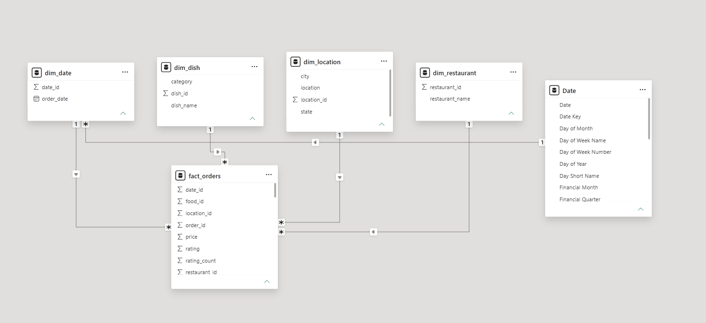
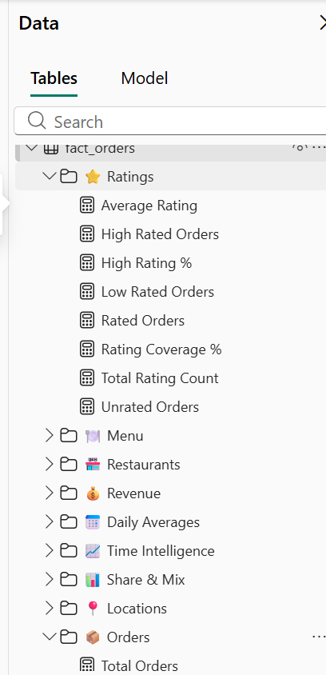
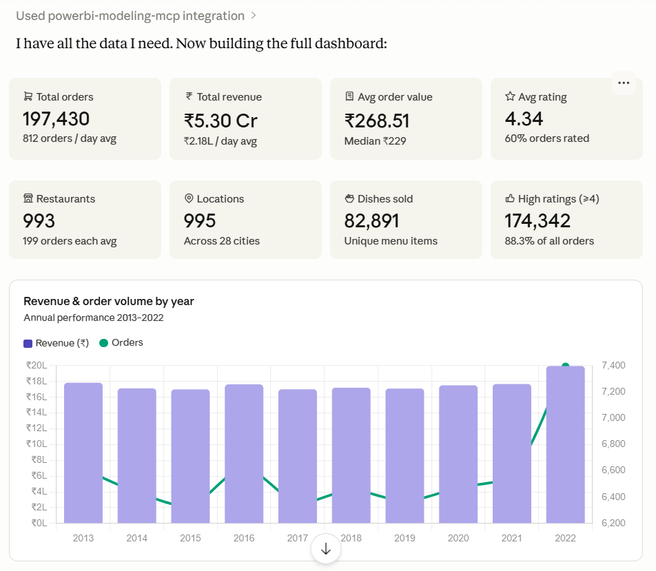
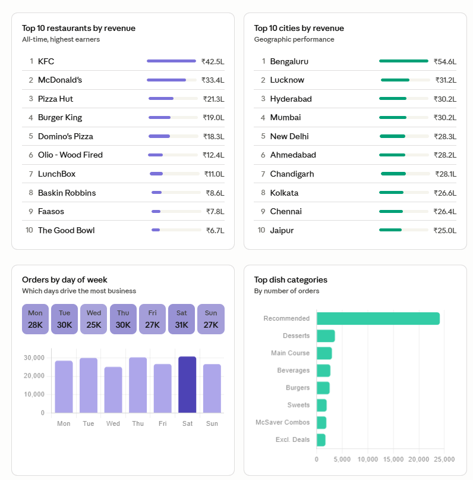
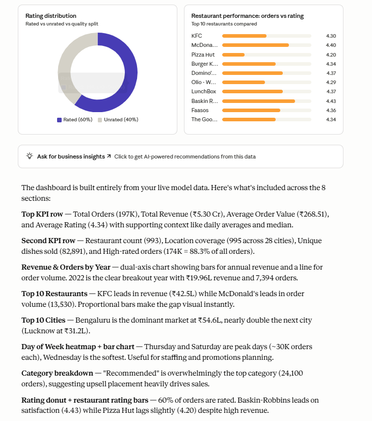
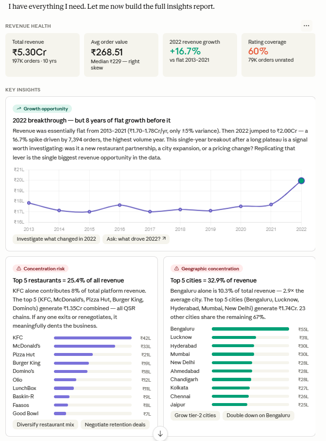
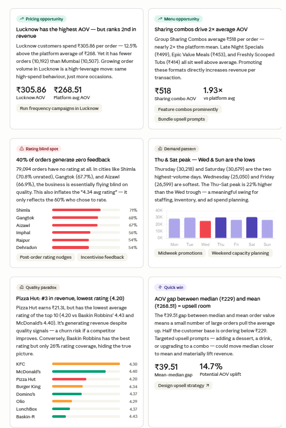
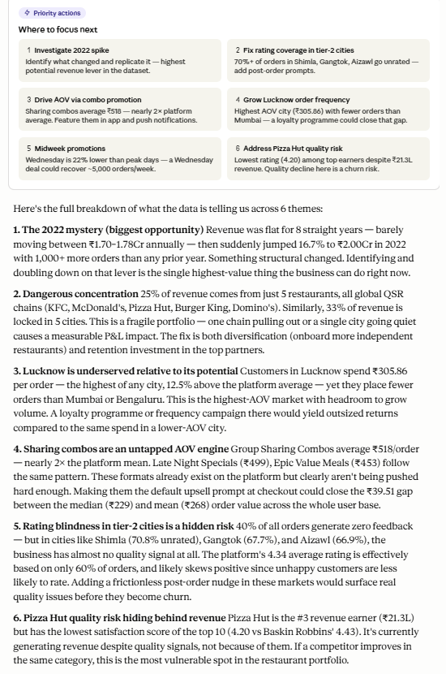

# 🚀 Automating Power BI Data Modeling with Claude AI & MCP

## 📌 The Project 
Let's be honest: building data models, mapping relationships, and writing dozens of standard DAX measures from scratch can be incredibly tedious. 

I built this Proof of Concept (PoC) to see if I could automate the backend development of a Power BI dashboard using a Large Language Model. By setting up a local **Model Context Protocol (MCP)** server, I successfully connected Claude AI directly to my Power BI Desktop environment. 

Instead of manually dragging connections and typing formulas, I prompted Claude to act as my backend BI developer. It analyzed the raw data, built the star schema, and wrote the DAX measures for me. 

## 🏗️ The Tech Stack
* **BI Tool:** Power BI Desktop (Saved as `.pbip` for GitHub version control)
* **AI Agent:** Claude Desktop App 
* **Middleware:** Model Context Protocol (MCP) Server (Power BI Modeling Extension)
* **IDE:** Visual Studio Code (VS Code)
* **Languages:** DAX, JSON

## ⚙️ How It Works (What I Built)
Instead of a manual build, I routed database operations through Claude. Here is what the AI successfully handled:
1. **Auto-Generated the Star Schema:** Claude parsed the raw CSVs (a Swiggy food delivery dataset), figured out the table relationships, fixed naming inconsistencies, and built a clean, functional star schema.
2. **Wrote 44 DAX Measures:** In just a few minutes, Claude wrote, validated, and categorized 44 complex DAX calculations into Power BI folders. This included:
   * **Core KPIs:** Total Revenue, Average Order Value (AOV).
   * **Time Intelligence:** MoM/YoY growth and rolling windows.
   * **Distribution metrics:** Weekend vs. Weekday throughput.

## 💡 The Real Value: Business Insights
Building the model is only half the job; the real test is extracting value. I asked Claude to analyze the semantic model it had just built and act as a strategic analyst. Here is what the data revealed:

* **The 2022 Revenue Anomaly:** After 8 years of stagnant, flat growth, revenue suddenly spiked 16.7% (to ₹2.00Cr) in 2022. Finding the root cause of this spike is the highest-priority action item for the business.
* **Dangerous Concentration Risk:** 25% of all revenue comes from just 5 global fast-food chains. If even one renegotiates or leaves, the P&L takes a massive hit. The business desperately needs to diversify its vendor mix.
* **The "Lucknow" Opportunity:** Lucknow has the highest Average Order Value (AOV) of any city (₹305), yet ranks 2nd in total revenue due to lower order volume. Running targeted frequency/loyalty campaigns here offers the highest return on marketing spend.
* **A Hidden Quality Blindspot:** 40% of all orders generate zero feedback. In some tier-2 cities, over 70% of orders are unrated. The business is flying blind on quality control and needs to implement frictionless post-order rating nudges.

## 🔧 Setup & Limitations
**How to replicate:** You need Power BI Desktop, VS Code, and Claude Desktop. Run the Power BI MCP extension in VS Code, point Claude's `claude_desktop_config.json` to that local server, open your `.pbip` file, and start prompting.

**Current Limitations:** Right now, the MCP server is strictly for backend operations. Claude can build the model, establish relationships, and write flawless DAX, but it cannot draw the actual charts on the Power BI canvas yet. The dashboard visuals you see below are UI mockups generated inside the Claude chat window to prove the data works. 

---

## 📸 Project Showcase

### 1. The Automated Data Model
*The star schema and relationships built entirely by the AI via the MCP connection.*

### 2. The DAX Measure Library
*A look at the 44 DAX calculations Claude wrote and neatly organized into folders in the Data pane.*

### 3. AI-Generated Dashboard UI
*The visual dashboard mockup rendered directly inside the Claude interface, proving the AI correctly interpreted the DAX measures and data distribution.*

### 4. Executing the Analysis
*The Claude interface executing the database operations and generating the strategic business insights directly from the live Power BI model.*

